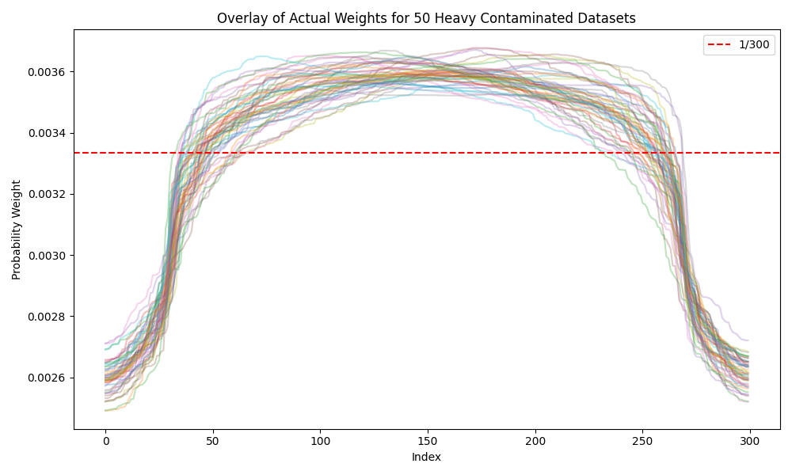

# Wasserstein Constrained Empirical Likelihood (wcETEL)

## Overview

This repository implements the Wasserstein-constrained exponentially tilted empirical likelihood (wcETEL) method, following:

> Chakraborty, A., Bhattacharya, A., & Pati, D. (2023). Robust probabilistic inference via a constrained transport metric. *arXiv preprint arXiv:2303.10085*.

The wcETEL method performs robust inference by combining:
- Empirical likelihood (EL)
- Wasserstein distance constraints

The Wasserstein penalty allows downweighting of contaminated data points and makes inference more robust under model misspecification.

This repository provides fully reproducible code for simulating datasets, computing wcETEL weights, and visualizing the results under various contamination levels.


---


## Method Summary

The wcETEL method solves the following optimization problem:

**w̃(θ) = argmin₍w₎ { D(Qw ∥ Pₙ) + λ W₂²(Qw, Fθ) }**

- $Q_w$ is a discrete distribution over the observed data points.
- $P_n$ is the empirical distribution.
- The Wasserstein distance $W_2$ is computed using semi-discrete optimal transport with power diagrams.

The iterative procedure updates weights using a fixed-point algorithm that combines empirical likelihood and optimal transport.


---


## Repository Structure

| File | Description |
|------|-------------|
| `data_generator.py` | Generate simulated datasets under different contamination settings |
| `run_wcETEL_analysis_module.py` | Implements wcETEL iterative weight updates using semi-discrete optimal transport |
| `optimal_transport_1d.py` | Power diagram & semi-discrete OT computations |
| `parallel_runner.py` | Parallel execution of wcETEL weight computation across datasets |
| `scripts/run_clean_mild_heavy.py` | Automates generating datasets and running analysis for all 3 settings |
| `scripts/plot_weights_overlay.py` | Generate overlay plots of weights for each contamination setting |
| `wcETEL_results/` | Stores output weights and intermediate results |
| `plots/` | Stores generated weight overlay plots for clean, mild, and heavy contamination |


---


## Key Classes and Algorithms

The core computations in wcETEL are based on semi-discrete optimal transport using power diagrams. This is implemented through the following two Python classes:

### 1. PowerDiagram1D

This class computes Laguerre (power) cells in one dimension, which are essential for semi-discrete optimal transport.

**Key functions:**
- `update_boundaries()` — computes the boundaries of Laguerre cells.
- `compute_integrals()` — computes integrals over each cell.
- `compute_integrals_gradient()` — computes gradients for optimization.

```python
class PowerDiagram1D:
    def __init__(self, X, weights=None, L=1.0):
        self.X = np.array(X, copy=True)
        self.n = len(X)
        self.weights = np.zeros(self.n) if weights is None else np.array(weights, copy=True)
        self.L = L
        self.Bounds = np.empty(self.n)
        self.indices = []
        self.updated_flag = False

    def set_positions(self, X):
        self.X = np.array(X, copy=True)

    def set_weights(self, weights):
        self.weights = np.array(weights, copy=True)
        self.updated_flag = False

    def update_boundaries(self):
        indices = [0, 1]
        u = (self.X**2 - self.weights) / 2
        def slope(i, j):
            return (u[j] - u[i]) / (self.X[j] - self.X[i])
        for i in range(2, self.n):
            while len(indices) >= 2 and slope(i, indices[-1]) <= slope(indices[-1], indices[-2]):
                indices.pop()
            indices.append(i)
        Bounds_noconstr = (u[indices][1:] - u[indices][:-1]) / (self.X[indices][1:] - self.X[indices][:-1])
        i0 = np.sum(Bounds_noconstr <= 0)
        iend = np.sum(Bounds_noconstr >= self.L)
        indices = indices[i0:len(indices) - iend]
        self.indices = indices
        self.Bounds = np.zeros(len(indices) + 1)
        self.Bounds[-1] = self.L
        self.Bounds[1:-1] = Bounds_noconstr[i0:len(Bounds_noconstr) - iend]
        self.updated_flag = True

    def compute_energy(self, fun=None):
        fplus = (self.Bounds[1:] - self.X[self.indices])**3 / 3
        fminus = (self.Bounds[:-1] - self.X[self.indices])**3 / 3
        return np.sum(fplus - fminus)

    def compute_integrals(self, fun):
        if not self.updated_flag:
            self.update_boundaries()
        N = len(self.Bounds) - 1
        integrals = np.zeros(N)
        for i in range(N):
            integrals[i], _ = quad(fun, self.Bounds[i], self.Bounds[i + 1])
        return integrals

    def compute_integrals_ipp(self, intp_fun, p=None):
        if p is None:
            p = len(intp_fun) - 1
        else:
            assert len(intp_fun) >= p + 1
        if p == 0:
            return intp_fun[0](self.Bounds[1:]) - intp_fun[0](self.Bounds[:-1])
        integrals_p = ((self.Bounds[1:] - self.X[self.indices])**p * intp_fun[0](self.Bounds[1:]) -
                       (self.Bounds[:-1] - self.X[self.indices])**p * intp_fun[0](self.Bounds[:-1]))
        integrals = -p * self.compute_integrals_ipp(intp_fun[1:], p=p - 1) + integrals_p
        return integrals

    def compute_integrals_gradient(self, fun):
        if not self.updated_flag:
            self.update_boundaries()
        Xact = self.X[self.indices]
        feval = fun(self.Bounds[1:-1])
        feval = feval * (1 - 1e-2) + 1e-2
        vect = 0.5 * feval / np.abs(Xact[1:] - Xact[:-1])
        vect0 = vect.copy()
        vect0[0] = 0
        costhess = diags(vect, -1) + diags(vect0, 1)
        vect1 = np.array(costhess.sum(axis=1)).flatten()
        vect1[0] = -1
        costhess -= diags(vect1)
        return -costhess
```

### 2. OptimalTransport1D
This class inherits from PowerDiagram1D and solves the semi-discrete optimal transport problem.

**Key functions:**
- `compute_ot_cost()` — computes the optimal transport cost.
- `update_weights()` — performs Newton updates to solve for Kantorovich potentials.

```python
class OptimalTransport1D(PowerDiagram1D):
    def __init__(self, X, masses, rho, intp_rho=None, L=1.0):
        super().__init__(X, L=L)
        self.masses = np.array(masses, copy=True)
        self.rho = rho
        self.intp_rho = intp_rho

    def compute_ot_cost(self):
        N = len(self.Bounds) - 1
        integrals = np.zeros(N)
        for i in range(N):
            fun = lambda x: ((x - self.X[self.indices][i])**2 - self.weights[self.indices][i]) * self.rho(x)
            integrals[i], _ = quad(fun, self.Bounds[i], self.Bounds[i + 1])
        return np.sum(integrals) + np.sum(self.masses * self.weights)

    def compute_ot_cost_ipp(self):
        term1 = np.sum(self.compute_integrals_ipp(self.intp_rho, p=2))
        term2 = np.sum(self.compute_integrals_ipp(self.intp_rho, p=0) * self.weights[self.indices])
        return np.sum(self.masses * self.weights) + (term1 - term2)

    def update_weights(self, tol=1e-6, maxIter=500, verbose=False):
        alphaA = 0.01
        tau_init = 0.5
        max_line_search_trials = 3
        self.update_boundaries()
        F = -self.masses.copy()
        if self.intp_rho is None:
            F[self.indices] += self.compute_integrals(self.rho)
            cost_old = self.compute_ot_cost()
        else:
            F[self.indices] += self.compute_integrals_ipp(self.intp_rho, p=0)
            cost_old = self.compute_ot_cost_ipp()
        error = np.linalg.norm(F)
        i = 0
        while error > tol and i < maxIter:
            Hess = self.compute_integrals_gradient(self.rho)
            theta = 0.0
            deltaw = -theta * F
            deltaw[self.indices] -= (1 - theta) * spsolve(Hess, F[self.indices])
            weights_old = self.weights.copy()
            tau = tau_init
            trial = 0
            while trial < max_line_search_trials:
                self.weights = weights_old + tau * deltaw
                self.update_boundaries()
                if self.intp_rho is None:
                    cost = self.compute_ot_cost()
                else:
                    cost = self.compute_ot_cost_ipp()

                if (cost >= cost_old + tau * alphaA * np.dot(F, deltaw)
                        and len(self.indices) == len(self.X)):
                    break
                else:
                    tau *= 0.8
                    trial += 1
            cost_old = cost
            i += 1
            F = -self.masses.copy()
            if self.intp_rho is None:
                F[self.indices] += self.compute_integrals(self.rho)
            else:
                F[self.indices] += self.compute_integrals_ipp(self.intp_rho, p=0)
            error = np.linalg.norm(F)
            if verbose:
                print(f"Newton step {i}, cost: {cost:.6f}, tau: {tau:.2e}, error: {error:.2e}")
            tau_init = min(tau * 1.1, 1.0)
        if i < maxIter and verbose:
            print("Optimization success!")
```


---


## Step-by-Step Pipeline

This section explains exactly how to reproduce all results from scratch.

### 1. Generate 50 datasets

Datasets are generated under 3 contamination settings: clean, mild, heavy.
We simulate 50 datasets for each of three contamination settings:

| Setting | Main signal | Contamination |
|---------|--------------|----------------|
| Clean   | 300 samples from Beta(2,2) | None |
| Mild    | 300 samples, with 14 contaminated points (7 Beta(1,100) and 7 Beta(100,1)) | Mild contamination |
| Heavy   | 300 samples, with 60 contaminated points (30 Beta(1,100) and 30 Beta(100,1)) | Heavy contamination |

The dataset generator is located in `data_generator.py`:

```python
def generate_datasets(mode="heavy", N=300, n_datasets=50):
    datasets = []
    for i in range(n_datasets):
        np.random.seed(1000 + i)
        if mode == "clean":
            sig = np.random.beta(2, 2, size=N)
            X = np.sort(sig)
        elif mode == "mild":
            sig = np.random.beta(2, 2, size=N - 14)
            noi_1 = np.random.beta(1, 100, size=7)
            noi_2 = np.random.beta(100, 1, size=7)
            X = np.sort(np.concatenate([sig, noi_1, noi_2]))
        elif mode == "heavy":
            sig = np.random.beta(2, 2, size=N - 60)
            noi_1 = np.random.beta(1, 100, size=30)
            noi_2 = np.random.beta(100, 1, size=30)
            X = np.sort(np.concatenate([sig, noi_1, noi_2]))
        datasets.append(X)
    return datasets
```

### 2. Compute wcETEL weights

We can execute all three contamination levels via:

```
python scripts/run_clean_mild_heavy.py
```
Or we can run individual modes:

```
python parallel_runner.py clean
```
```
python parallel_runner.py mild
```
```
python parallel_runner.py heavy
```

Results will be stored in the wcETEL_results/ folder.

The weight computations are fully parallelized using parallel_runner.py.
The run_wcETEL_analysis_module is implemented inside it.

```python
def run_wcETEL_analysis(X):
    L = 1.
    N = len(X)
    masses = np.ones(N) / N
    rho0 = lambda x: 6 * x * (1 - x)
    mass = 1.
    masses = masses * mass
    eta = 1e-3
    maxiter = 3000
    for i in range(maxiter):
        ot = OptimalTransport1D(X, masses, rho0, L=L)
        ot.update_weights(maxIter=1, verbose=False)
        ww = ot.weights
        masses1 = masses + eta * (-1 - np.log(N * masses) - 2 * 5 * ww)
        temp = np.max(np.where((masses1 + 1 / (np.arange(1, N + 1)) * (1 - np.cumsum(masses1)) > 0))) + 1
        right_shift = (1 / temp) * (1 - np.cumsum(masses1)[temp - 1])
        masses1 = masses1 + right_shift
        masses1[masses1 < 0] = 0
        err = np.sum((masses - masses1) ** 2)
        if err <= 1e-20:
            break
        masses = masses1
    print(f"Final error after loop: {err:.2e}")
    return ot.weights, masses1
```

### 3. Generate weight overlay plots

After all computations are completed, generate plots:

```
python scripts/plot_weights_overlay.py
```

This will generate 3 overlay plots under the plots/ folder.

Heavy contamination example:



Mild contamination example:


Clean contamination example:


### The entire pipeline can be run directly from the `parallel.ipynb` notebook.

The notebook will:
- Launch 3 contamination settings in parallel.
- Compute wcETEL weights using `parallel_runner.py`.
- Generate and save all weight overlay plots.
- Display all plots directly inside the notebook.


